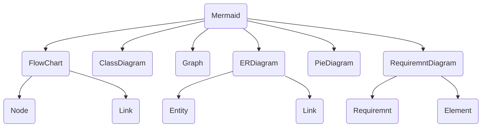

# Mermaid-py

this package works as an interface for the famous mermaid-js library that uses scripts to create diagrams.

## Description

Briefly describe your project here. Explain what it does and what makes it special.

## Examples
first install `mermaid-py` by `pip install mermaid-py`.
```python
import mermaid as md
from mermaid.graph import Graph

graph: Graph = Graph('first-graph',"""
graph TD;
    mer(Mermaid)
    flow(FlowChart);
    clas(ClassDiagram)
    gra(Graph)
    erDigram(ERDiagram)
    erdiagram-link(Link)
    entity(Entity)
    flow-link(Link)
    node(Node)
    mer --> flow
    mer --> clas
    mer --> gra
    mer --> erDigram
    flow --> node & flow-link
    erDigram --> entity & erdiagram-link
""")
graphe: Mermaid = Mermaid(graph)
graphe # !! note this work just in notbooke that render html.
```
the result will be like this



## Technologies Used

- Python3
- Poetry

## To contribute to `mermaid-py`

If you'd like to contribute to this open source project folow this steps:

1. Forke the repo and then clone it.
2. Navigate to the project directory: `cd mermaid-py`.
3. create a local enviroment `python3 -m venv env`.
4. activate the env `source env/bin/activate`.
5. install the dependecies `poetry install`.
6. happy coding :) .

## List of Diagrames
- [x] [FlowChart](https://mermaid.js.org/syntax/flowchart.html)
- [ ] [Sequence Diagram](https://mermaid.js.org/syntax/sequenceDiagram.html)
- [ ] [Class Diagram](https://mermaid.js.org/syntax/classDiagram.html)
- [ ] [State Diagram](https://mermaid.js.org/syntax/stateDiagram.html)
- [x] [Entity Relationship Diagram](https://mermaid.js.org/syntax/entityRelationshipDiagram.html)
- [ ] [User Journey](https://mermaid.js.org/syntax/userJourney.html)
- [ ] [Gantt](https://mermaid.js.org/syntax/gantt.html)
- [x] [Pie Chart](https://mermaid.js.org/syntax/pie.html)
- [ ] [Quadrant Chart](https://mermaid.js.org/syntax/quadrantChart.html)
- [ ] [Requirement Diagram](https://mermaid.js.org/syntax/requirementDiagram.html)
- [ ] [Gitgraph (Git) Diagram 🔥](https://mermaid.js.org/syntax/gitgraph.html)
- [ ] [C4 Diagram 🦺⚠️](https://mermaid.js.org/syntax/c4.html)
- [ ] [Mindmaps 🔥](https://mermaid.js.org/syntax/mindmap.html)
- [ ] [Timeline 🔥](https://mermaid.js.org/syntax/timeline.html)
- [ ] [Zenuml 🔥](https://mermaid.js.org/syntax/zenuml.html)
- [ ] [Sankey 🔥](https://mermaid.js.org/syntax/sankey.html)
- [ ] [XYChart 🔥](https://mermaid.js.org/syntax/xychart.html)

## License

This project is licensed under the [MIT License](LICENSE).

## Contact

If you have any questions or want to get in touch, you can reach out to me at [rachidouhammou21@gmail.com](rachidouhammou21@gmail.com).
