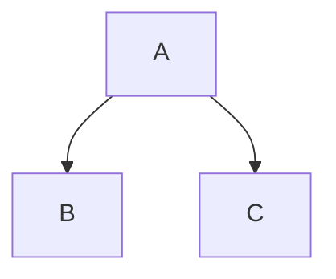

# Welcome to Mermaid-Py

A simple interface for the the famous lib mermaid-js to create diagrams.[mermaid.js.org](https://mermaid.js.org/).

## Get started

* install memaid-py using pypi `pip install mermaid-py`.

```python
from mermaid import Mermaid
from mermaid.graph import Graph
graph = """
graph TD;
    A --> B
    A --> C
"""
Memaid(graph)
```

the result in `notebook`


