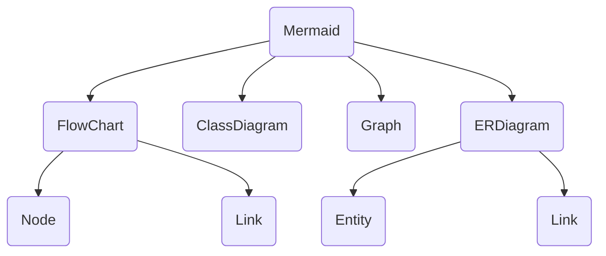

# Get Started with `mermaid-py`

To get started with `mermaid-py`, follow these steps:

1. Install `mermaid-py` by running the following command:

  ```bash
  pip install mermaid-py
  ```

2. Import the mermaid-py module in your Python script:


``python filename="main.py" {1,2,4,22} copy
import mermaid as md
from mermaid.graph import Graph

graph: Graph = Graph('first-graph',"""
graph TD;
    mer(Mermaid)
    flow(FlowChart);
    clas(ClassDiagram)
    gra(Graph)
    erDigram(ERDiagram)
    erdiagram-link(Link)
    entity(Entity)
    flow-link(Link)
    node(Node)
    mer --> flow
    mer --> clas
    mer --> gra
    mer --> erDigram
    flow --> node & flow-link
    erDigram --> entity & erdiagram-link
""")
graphe: md.Mermaid = md.Mermaid(graph)
graphe # !! note this work just in notbooke that render html.

```

the result will be like this



